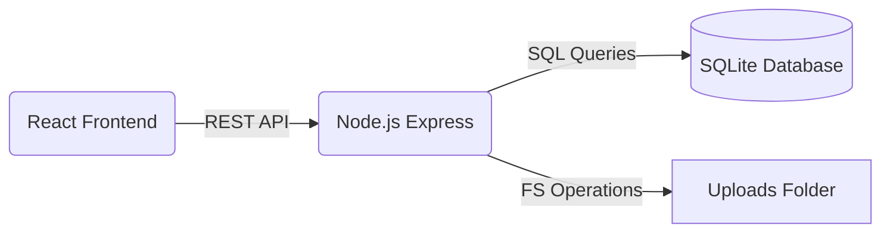

# System Architecture

This document describes the high-level architecture of the Repair & Equipment Replacement Management System.

## Architecture Overview

The system follows a classic **Client-Server** architecture:

- **Frontend (Client)**: A Single Page Application (SPA) that handles the UI/UX, user interactions, and local state management. It communicates with the backend via RESTful APIs.
- **Backend (Server)**: A REST API that handles business logic, database operations (SQLite), and file storage (uploads).



## Data Flow

1. **User Interaction**: User performs an action on the UI (e.g., submitting a repair form).
2. **API Request**: The React client uses `axios` (via custom `useApi` hook) to send a request to the server.
3. **Logic & DB**: The server validates the request, performs necessary logic, and updates the SQLite database.
4. **Response**: The server sends a JSON response back to the client.
5. **UI Update**: The React client updates its state and re-renders the UI to reflect the changes.

## Database Schema

The system uses SQLite. The primary tables are:

- **`repairs`**: Core table for tracking repair tickets.
- **`repair_logs`**: Audit trail for actions taken on repair tickets.
- **`device_changes`**: Tracks serial/model changes during repairs.
- **`repair_images`**: Metadata for images attached to repairs.
- **`inventory`**: Tracks equipment stock and specifications.
- **`withdrawals`**: Records equipment requests/withdrawals.
- **`withdrawal_items`**: Junction table mapping withdrawals to inventory items.
- **`purchase_orders`**: Stores details of parts procurement tickets (requester, status, project, vendor).
- **`purchase_order_items`**: Junction table mapping purchase orders to item specifications.
- **`inventory_transactions`**: Audit trail ledger logs tracking all stock additions, withdrawals, and returns.

## API Design

The API is organized by resource:

- `/api/repairs`: CRUD operations for repair tickets, logs, and status updates.
- `/api/inventory`: CRUD operations for equipment inventory and stock management.
- `/api/withdrawals`: Handling equipment withdrawal requests, items, and returns.
- `/api/purchase-orders`: Procurement workflow, stock replenishment upon receiving, and deletion with rollback.
- `/api/transactions`: Read-only queries for the unified inventory movement ledger history.
- `/api/reports`: Analytics dashboard widgets data and CSV report generation.

## Directory Structure

```text
/client
├── src/
│   ├── api.ts          # Axios instance & API wrappers
│   ├── components/     # Reusable UI components
│   ├── hooks/          # Custom hooks (e.g., useApi)
│   ├── pages/          # Main application views/routes
│   ├── types.ts        # TypeScript interfaces/types
│   └── utils/          # Helper functions (Formatting, PDF generation)
/server
├── controllers/        # Request handlers & logic
├── database/           # SQLite initialization and connection
├── middlewares/        # Express middlewares (Error handling, Uploads)
├── routes/             # API route definitions
└── uploads/            # Storage for uploaded images
```
